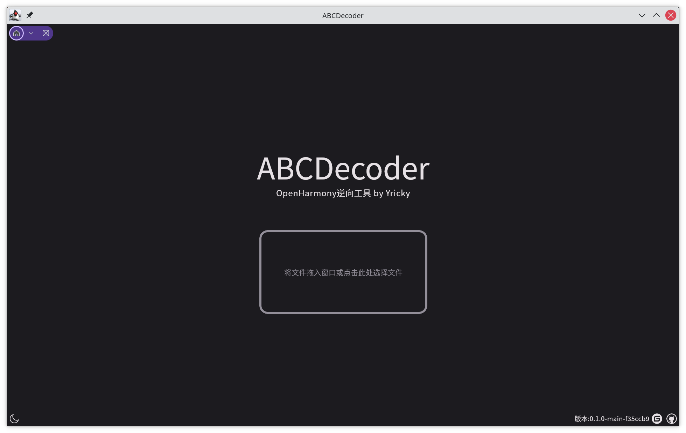
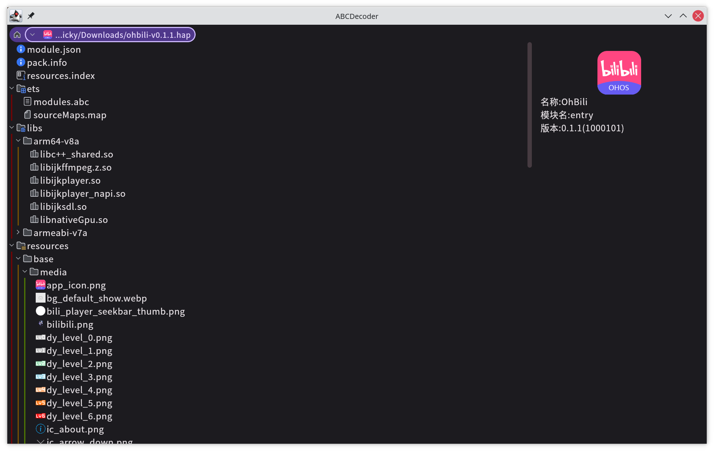
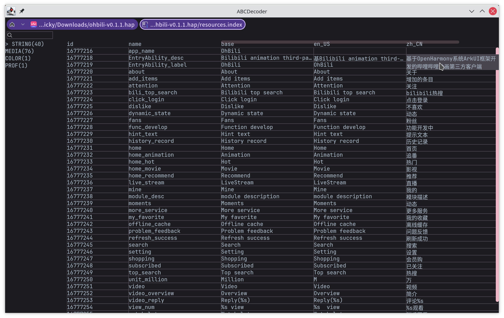
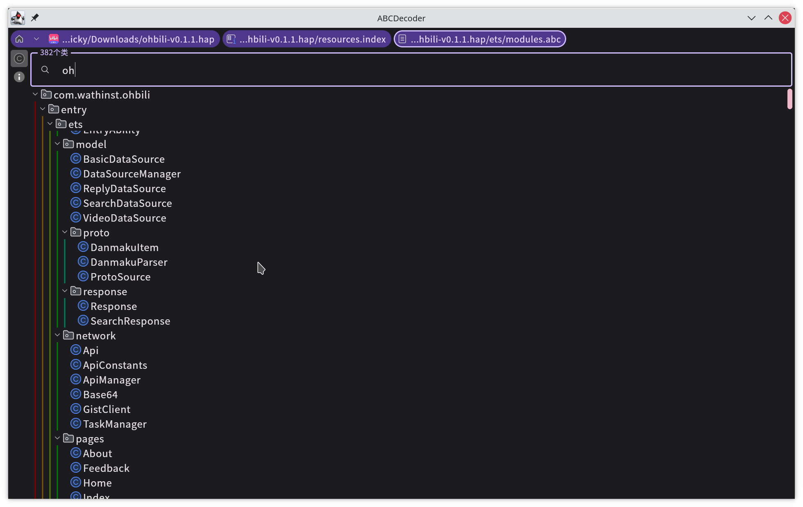
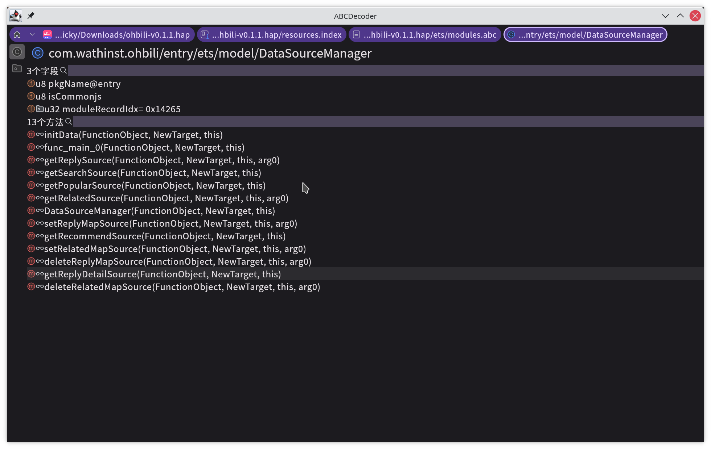
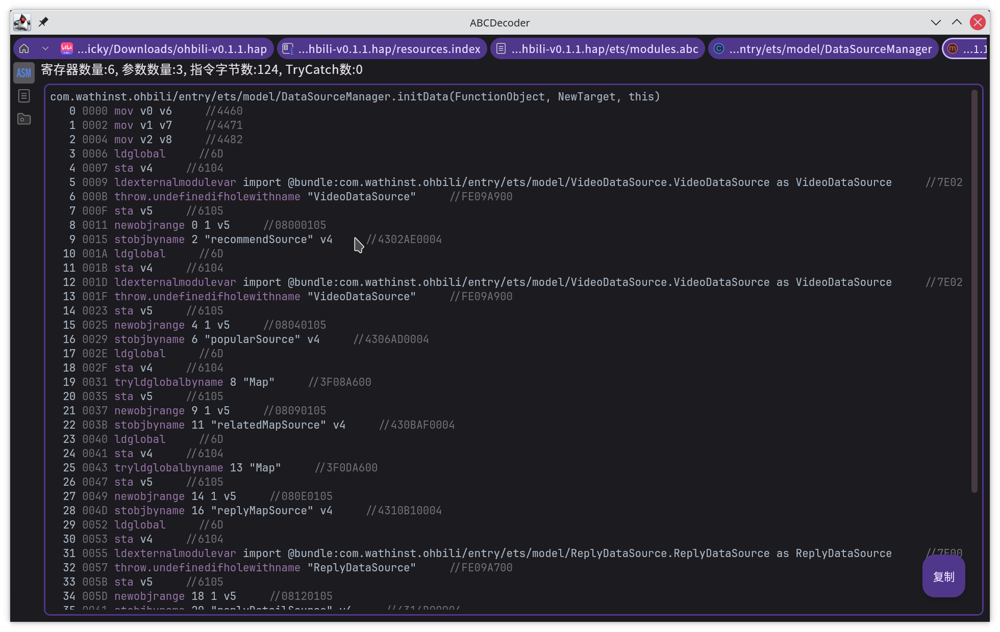

# ABCDE
> OpenHarmony逆向工具包 by Yricky
> 
> [查看完整文档目录](docs/index.md)


ABCDE是一个使用Kotlin编写的OpenHarmony逆向工具包，目前已经实现的功能为解析方舟字节码文件中
的类信息、方法信息、字面量数组信息以及对方法进行反汇编，解析资源索引文件等功能。

该工具核心功能由纯kotlin（jvm）实现，因此可以提供平台无关的jar包供java工程引用并二次开发

## 构建
### 环境需求
- JDK17+

### 构建UberJar
```shell
./gradlew :abcdecoder:packageReleaseUberJarForCurrentOS
```
> 也可以去[github actions](https://github.com/Yricky/abcde/actions)
> 中下载最新的构建

## 功能演示
### 主页面

可以拖入或点击打开文件，支持文件类型有.abc、.hap、.index等
### hap页面

这里可以以树形结构查看hap中的内容，其中的abc和index文件能够点击打开。
如果解析成功，该hap的部分包信息将在右侧展示。
### 资源索引查看页面

这里提供与android studio查看arsc类似的功能，可以查看openHarmony
资源索引文件中的内容，并支持按类型区分和名称+内容的查找。
### abc文件查看页面

这里可以按照树形结构查看abc字节码文件中的类信息，支持按名称查找。左侧
信息页签也支持查看字节码版本、校验和等信息。
### 类信息和字节码查看

点入某个类后，可以查看类的方法和字段。支持简单的索引，左侧信息页签中可以查看
这个类的导入导出信息

点击类中的某个方法即可查看该方法的字节码。

### 命令行
目前支持使用命令行解析出abc文件中的class列表和资源索引文件中的内容
以下是命令行示例：

> dump class
```shell
java -jar /path/to/abcdecoder.jar --cli --dump-class /path/to/module.abc [--out=out.txt]
```

> dump index
```shell
java -jar /path/to/abcdecoder.jar --cli --dump-index /path/to/resources.index [--out=out.json]
```

